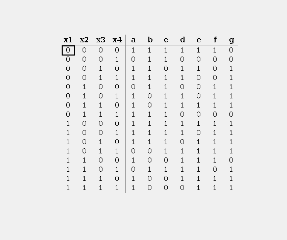
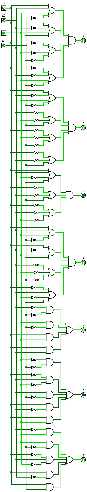

## Lab №1 

### Задание 

#### Декодер. 
  
Необходимо составить логическую схему декодера для семисегментного индикатора.\
На вход декодера подаётся 4-х битное число, на выходе формируются управляющие сигналы индикатора (7 сигналов: A-G).

### Решение задания

Для начала составим таблицу истинности для 7-сегментного индикатора.

    

 Рис.1: Таблица истинности для 7-сегментного индикатора 

На вход подаем 4-х битное число: (x1 x2 x3 x4).\
На выходе получаем 7-сигналов: (a b c d e f g).

Составим Совершенную Конъюктивную Нормальную Форму, использую минимизацию по Карно:

 - Для выхода A: (x1 + x2 + x3 + ~x4)(x1 + ~x2 + x3 + x4)(~x1 + x2 + ~x3 + ~x4)(~x1 + ~x2 + x3 + ~x4)
 - Для выхода B: (x1 + ~x2 + x3 + ~x4)(~x2 + ~x3 + x4)(~x1 + ~x3 + ~x4)(~x1 + ~x2 + x4)
 - Для выхода С: (x1 + x2 + ~x3 + x4)(~x1 + ~x2 + x4)(~x1 + ~x2 + ~x3)
 - Для выхода D: (x1 + x2 + x3 + ~x4)(x1 + ~x2 + x3 + x4)(~x2 + ~x3 + ~x4)(~x1 + x2 + ~x3 + x4)
 - Для выхода E: (~x2 ~x4) + (x3 ~x4) + (x1 x3) + (x1 x2)
 - Для выхода F: (~x3 ~x4) + (~x1 x2 ~x3) + (x2 ~x4) + (x1 ~x2) + (x1 x3)
 - Для выхода G: (~x2 x3) + (x3 ~x4) + (~x1 x2 ~x3) + (x1 ~x2) + (x1 x4)

В программе Logisim была составлена логическая схема декодера для семисегментного индикатора.

    

 Рис.2: Логическая схема декодера 7-cегментного индикатора 

