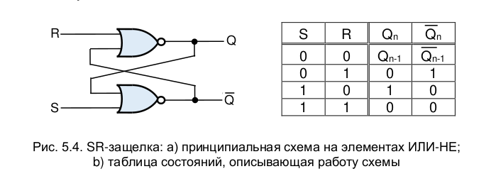
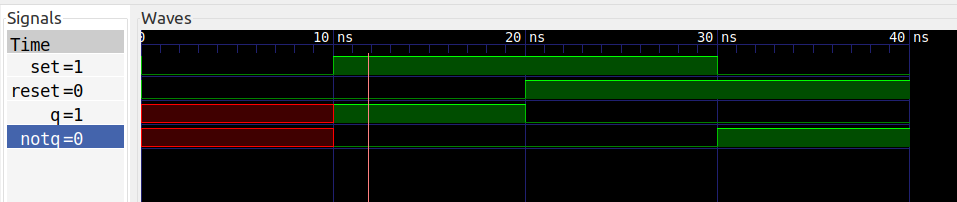
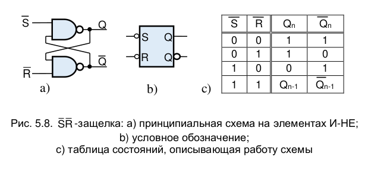
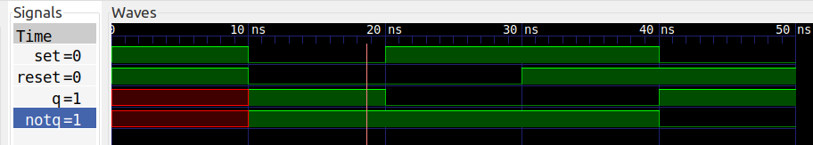
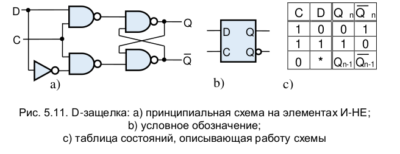
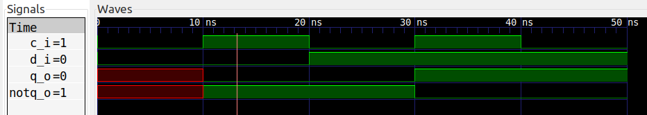
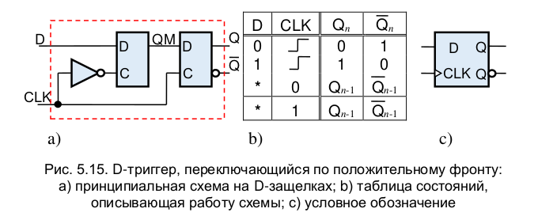
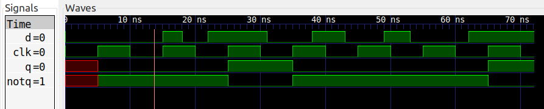

## Lab №2 

### Задание 

#### Verilog триггеры. 
  
Необходимо описать на языке Verilog:

1. SR-Latch, причем описать необходимо с помощью комбинационных элементов.

2. D-Latch, причем описать необходимо с помощью комбинационных элементов и подключить SR-Latch.

3. D-Flip-Flop, причем описать необходимо с помощью комбинационных элементов и подключить D-Latch.

4. Написать TestBench для каждой схемы.

5. Прикрепить временную диаграмму для каждой схемы.

Для компиляции модулей используется Icarus Verolog (iverilog). Для визуализации временных диаграмм симулятор gtkwave.

### Решение задания

Все схемы, используемые в этой работе, были взяты из книги А. Л. Ларина "Основы цифровой электроники".

#### 1. SR-Latch

Рассмотрим схему SR-Latch:

<p align="center">
    

Принцип работы понятен из таблицы состояний.

Теперь реализуем модуль SR-Latch:

```v
module sr_latch(
    input wire set_i,
    input wire reset_i,
    output wire q_out,
    output wire notq_out
);

    wire q_int, notq_int;

    assign q_int = ~(reset_i | notq_int);
    assign notq_int = ~(set_i | q_int);
    assign q_out = q_int;
    assign notq_out = notq_int;

endmodule
```
Полученная временная диаграмма:

<p align="center">
    
<p align="center"> Временная диаграмма для SR-Latch<p align="center">

#### 1.1 not_SR-Latch

Для реализации D-Latch, нам потребуется not_SR-Latch.\
Рассмотрим схему not_SR-Latch:

<p align="center">
    

И реализуем сам модуль not_SR-Latch:

```v
module not_sr_latch(
    input wire set_i,
    input wire reset_i,
    output wire q_out,
    output wire notq_out
);

    wire q_int, notq_int;

    assign q_int = ~(set_i & notq_int);
    assign notq_int = ~(reset_i & q_int);
    assign q_out = q_int;
    assign notq_out = notq_int;

endmodule
```
Полученная временная диаграмма:

<p align="center">
    
<p align="center"> Временная диаграмма для not_SR-Latch<p align="center">

#### 2. D-Latch

Рассмотрим схему D-Latch:

<p align="center">
    

Принцип работы понятен из таблицы состояний.\
Как видно из схемы, задействуется модуль not_SR-Latch.

Теперь реализуем модуль D-Latch, используя также модуль not_SR-Latch:

```v
module d_latch(
    input wire d_i,
    input wire c_i,
    output wire q_o,
    output wire notq_o
);

    wire set, reset;

    assign set = ~(d_i & c_i);
    assign reset = ~(~d_i & c_i);
    
    not_sr_latch not_sr_latch_inst(
        .set_i(set),
        .reset_i(reset),
        .q_out(q_o),
        .notq_out(notq_o)
    );
        
endmodule
```

Полученная временная диаграмма:

<p align="center">
    
<p align="center"> Временная диаграмма для D-Latch<p align="center">

#### 3. D-Flip-Flop

Рассмотрим схему D-Flip-Flop:

<p align="center">
    

Принцип работы понятен из таблицы состояний.\
Как видно из схемы, задействуются 2 модуля D-Latch.

Теперь реализуем модуль D-Flip-Flop, используя также 2 модуля D-Latch:

```v
module d_flip_flop(
    input wire d_i,
    input wire clk_i,
    output wire q_o,
    output wire notq_o
);
    
    wire qm;
    
    d_latch d_latch_1(
        .d_i(d_i),
        .c_i(~clk_i),
        .q_o(qm)
    );
    
    d_latch d_latch_2(
        .d_i(qm),
        .c_i(clk_i),
        .q_o(q_o),
        .notq_o(notq_o)
    );
    
endmodule

```
Опишем TestBench для D-Flip-Flop:

```v
`timescale 1ns/10ps

module tb;  

    reg d;
    reg clk;
    wire q;
    wire notq;
    
    integer i;
    realtime period = 10;
    reg [3:0] delay;    
    integer seed = 2; //for random
    
    d_flip_flop d_flip_flop_inst(
        .d_i(d),
        .clk_i(clk),
        .q_o(q),
        .notq_o(notq)
    );

    always #(period/2) clk = ~clk;

    initial begin
        $dumpvars;
        $display("SUCCESS");
        
        clk = 0;
        d = 0;
        #period;
        
        for (i = 0; i < 10; i=i+1)
        begin
            delay = $urandom(seed) % 10 + 1;
            #(delay) d = i;
            $display("delay = %0d: d = %0b, clk = %0b, q = %0b, notq = %0b", delay, d, clk, q, notq);
        end
        
        #period;
        $finish;
    end

endmodule

```

Полученная временная диаграмма:

<p align="center">
    
<p align="center"> Временная диаграмма для D-Flip-Flop<p align="center">

